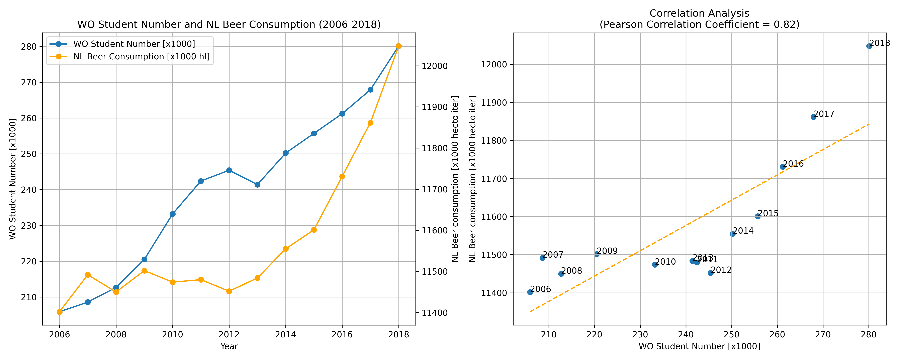

Student ID: 13786423

The title of the following papers pivotal to our knowledge:

- MCC Van Dyke et al., 2019 _Fantastic yeasts and where to find them: the hidden diversity of dimorphic fungal pathogens_
- JT Harvey, Applied Ergonomics, 2002 _An analysis of the forces required to drag sheep over various surfaces_
- DW Ziegler et al., 2005 _Uterine contractility and embryo implantation_

The Pearson correlation coefficient is larger than 0.8. That is to say, NL beer consumption is highly correlated with WO student number. Selling beer to them may be a good business!